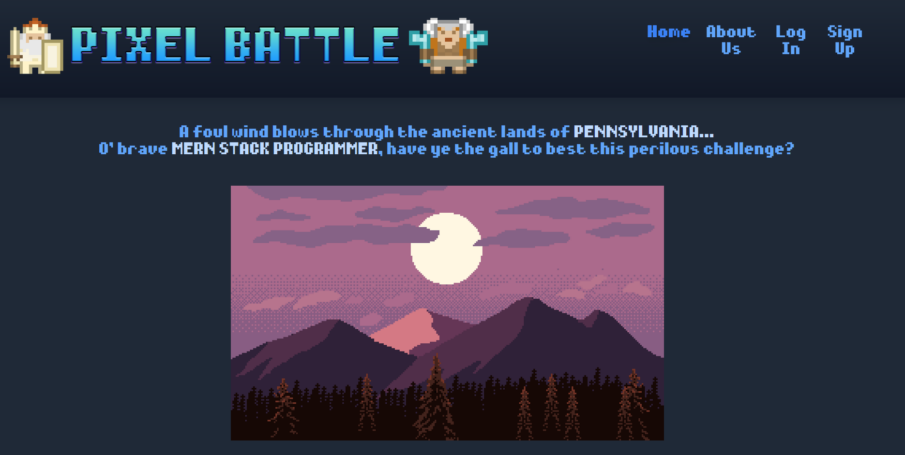
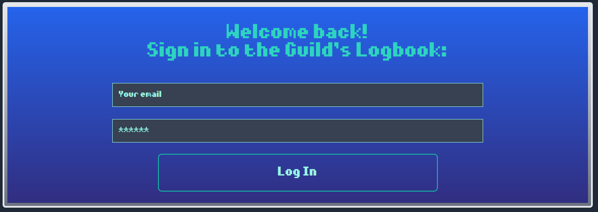
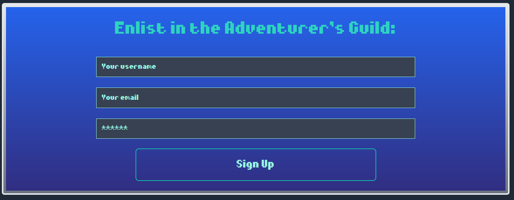
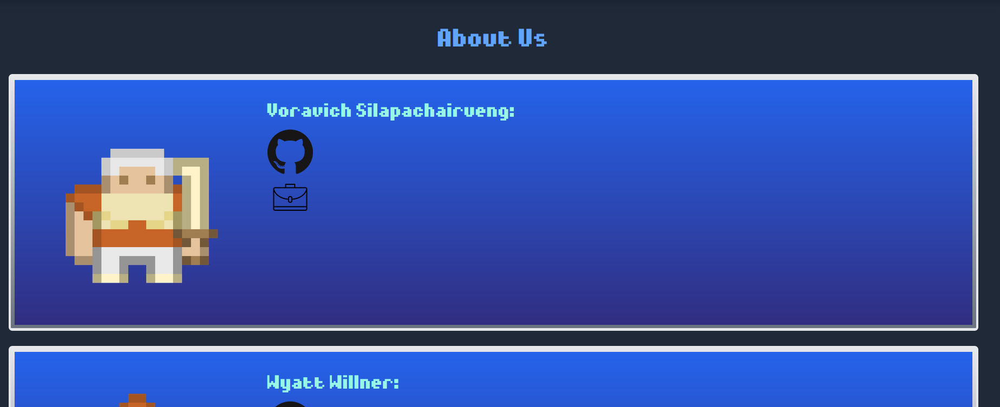
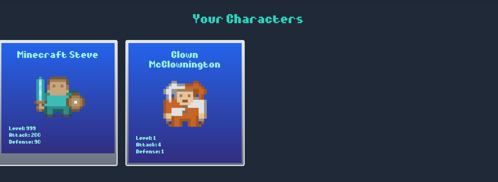
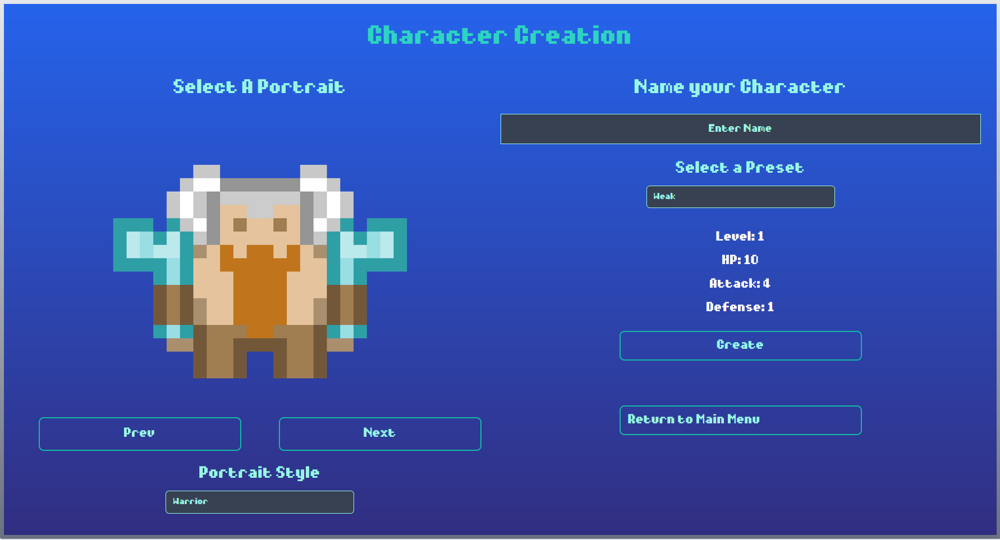
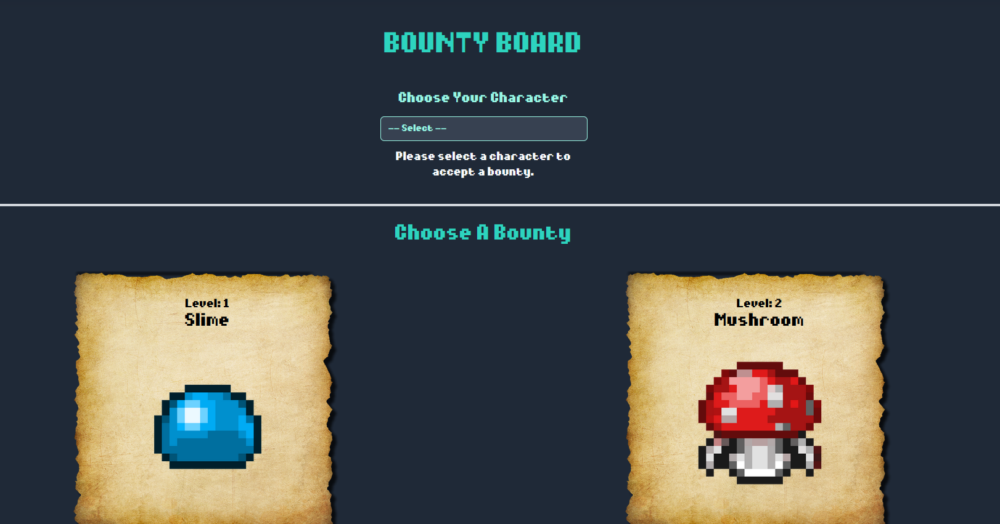
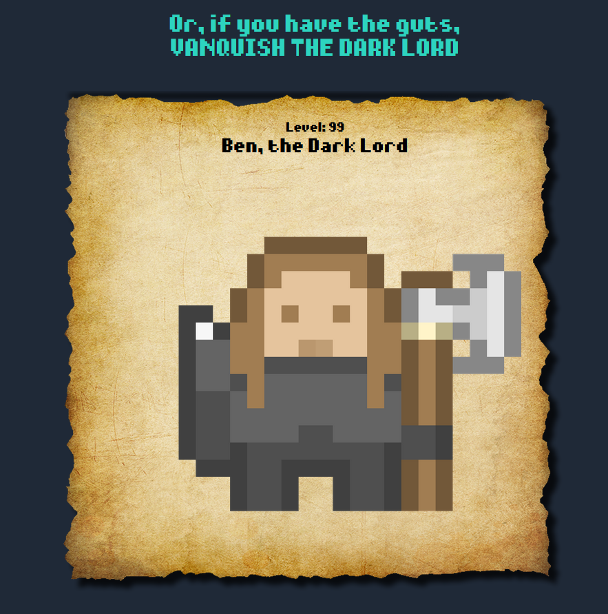
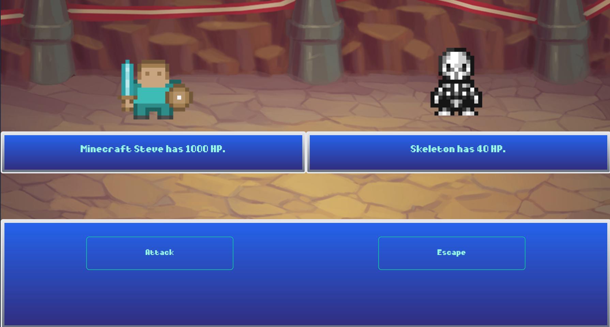

# Pixel Battle  

  ## Table of Contents:
  1. [Description](#description)
  2. [Usage](#usage)
  3. [Screenshots](#screenshots)
  4. [License](#license)
  5. [Credits](#credits)

  ## Description 

  MERN stack application, with front-end in React and a back-end in MongoDB. Pixel Battle is a game that allows users to login/signup, create a character, and then battle monsters in turn-based combat. This game was made possible using sprites and backgrounds from opengameart.org.

  ## Usage 

  When first entering the site, users are presented with the premise of the game and two options on the bottom menu: sign up, or login (in fancier terms). Clicking these options with take the user to the respective page where they can login or sign up. 
  
  After logging in, a user is taken back to the home screen where the option have now changed to either character creation or choosing a monster to battle (in fancier terms).

  The character creation menu consists of portrait selection, naming the character, and choosing a preset for the character's stats. A user may choose the portrait style of the pixel sprites, from either Warrior, Mage, Rogue, or Special sprites, from the dropdown menu. The presets are also in a dropdown menu, that define the character's fixed stats on creation. After clicking create on the character creation page, this character is saved to the database and is prompted to return to the main menu. A user may need to refresh the page to see that the character is in the database. 

  A user may click on the navigation option, "My Profile" to see the saved characters in their account.

  A user may click on the navigation option, "About Us" to see information about the authors of the app.

  After a character has been made, a user may click on "Accept a Bounty from the Board." This takes the user to a Bounty Board, where they can select one of their created characters and a monster to enter battle. The dropdown options will populate with the user's saved characters, and after selecting a character, the "Accept" option shows up on the bounty papers for the monsters. Clicking accept will start a battle.

  In battle, there are only two options: Attack, and Escape. Although, as it is now, both do the same thing, attack the enemy. Attacking the enemy will display the results of the exchange between the user's character and the enemy, and will continue as long as the user keeps attacking until one side reaches 0 HP. Once that happens, a new option appears in the menu, congratulating the user for winning or reporting the loss to the user. This button will return the user to the main menu to start over again.

  ## Screenshots

  * Main Menu

* Sign Up

* Log In

  * About Us

* Profile 

* Character Creation

  * Bounty Board

* Ben, The Dark Lord

* Battle 

  ## License 

 

"Permissions of this strong copyleft license are conditioned on making available complete source code of licensed works and modifications, which include larger works using a licensed work, under the same license. Copyright and license notices must be preserved. Contributors provide an express grant of patent rights."

Read more about this license at: https://choosealicense.com/licenses/gpl-3.0/

 ## Credits

 Ida Kukimiya: https://github.com/idakukimiya

 Eric Courter: https://github.com/Amob7

 Voravich Silapachairueng: https://github.com/voravichs

 Wyatt Willner: https://github.com/wyattwillner55

